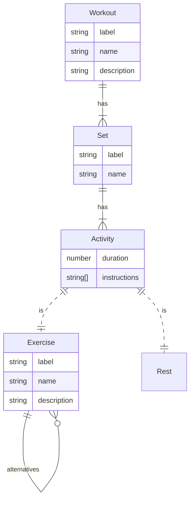
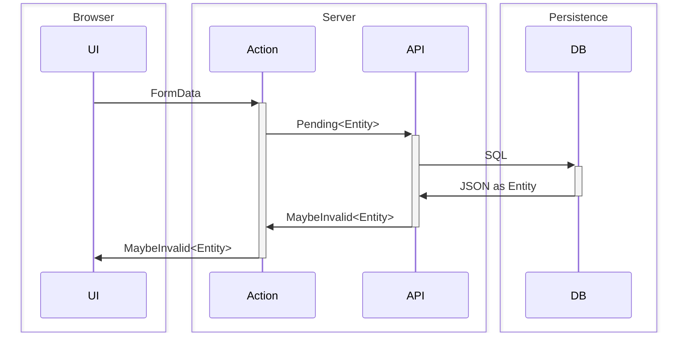

# SvelteKit Template

This project contains a working, mostly fleshed-out template for a SvelteKit app. It performs <accronym title="Create, Read, Update, Delete">CRUD</acronym> on _entities_, or domain objects&em;the nouns in your app.

The example models a workout, like at the gym. A Workout contains an ordered collection of Sets. A Set is made up of an ordered collection of Activities. Activities can be Exercises or Rest and have a duration, measured in a number of seconds.

## Entities

The entities are modeled as TypeScript types in [`$lib/entities.d.ts`](https://github.com/jmakeig/workout-builder3/blob/main/src/lib/entities.d.ts). In addition to its strongly typed definition, each entity has a `Pending` version. _Pending_ entities are loosely typed, allowing them to be bound to inputs, for example, in a HTML form that only supports `string` inputs (well, [`FormData`](https://developer.mozilla.org/en-US/docs/Web/API/FormData)).



## CRUD

Each entity has the following default routes:

- <code>/<kbd>entities</kbd></code>: Lists all instances, allows clicking into
  - `/[label]`: An individual entity instance, by default, read-only
    - `/edit`: A form view that allows for updating an individual instance
  - `/new/`: A form view to create a new instance. A `POST` redirects to `/eneties/[label]` or `/eneties/[label]/edit`.

### Data Access

All data access goes through an API library, `$lib/server/api.js`. The API is responsible for encapsulating the database and enforcing business rules. The `$lib/server` path ensures that it‘s not executed on the client. Centralization also simplifies integration testing the API and mocking for UI tests.

#### Validation

Enforcing business rules, such as validating user inputs or handling database constraint violations, are communicated as part of an API’s return types. An `InvalidResult` type return provides a standard way for a function to return the user input and a collection of one or more validation errors. APIs should only throw (or bubble) exceptions for unexpected states that the user cannot fix themselves by submitting different data. For example, an empty value for a required property is a validation error, not an exceptional case. The user should resubmit with a different value. A dropped database connection, on the other hand, is an error state that the user can’t do anything about.



<figure>
    <figcaption>Example API function, <a href="https://github.com/jmakeig/workout-builder3/blob/main/src/lib/server/api.js"><code>$lib/server/api.js</code></a></figcaption>

<pre>
/**
 * (1)
 * @param {Pending<kbd>Entity</kbd>} input
 * (2)
 * @returns {Promise&lt;Result&lt;Pending<kbd>Entity</kbd>, <kbd>Entity</kbd>, '<kbd>entity</kbd>'>>}
 */
export async function create_<kbd>entity</kbd>(input) {
  /** @type {Validation&lt;<kbd>Entity</kbd>>[]} */
  const validations = [];
  // (3)
  if (!test(input.<kbd>property</kbd>)) 
    validations.push({ message: 'Name is required', for: '<kbd>property</kbd>' });
  // (4)
  if (has(validations)) {
    return { <kbd>entity</kbd>: input, validations };
  }
  // (5)
  const <kbd>entity</kbd> = await /** @type {<kbd>Entity</kbd>} */ (
    db.query(`INSERT <kbd>entity</kbd> RETURNING …`);
  );
  return <kbd>entity</kbd>;
}
</pre>
</figure>

1. Inputs typcially use the `Pending` version of the entity type. This allows (mostly) straightforward mapping from `FormData` in the calling form handler.
2. APIs that perform validation use the `Result<In, Out, Prop>` return type to convey return values.
   - `In` is the type of `input`, for CRUD operations, usually the `Pending` version of an entity
   - `Out` is the expected return type, often the strongly typed form of the pending input. [Postel’s Law](https://en.wikipedia.org/wiki/Robustness_principle): “Be conservative in what you send, be liberal in what you accept from others.”
   - `Prop` is the `string` name of the property in which the `input` will be stashed in the `InvalidResult` instance.
3. Page handlers, `+page.server.js`, should be “dumb”. They should be responsible for collecting data from the UI and passing to the appropriate API. APIs implement the valaidation logic. Validation errors return `InvalidResult` instances. Page handlers can use the `is_valid()` guard function to differentiate between a `Result` and `InvalidResult` type.
4. In the happy path, where the input is valid, the return value does not need to be wrapped. This is equivalent to a <code><kbd>Entity</kbd></code> return type. Thus APIs that don’t do any validation do not need to do the `Result`/`InvalidResult` rigamarole.

<figure>
    <figcaption>Page handler, <code>+page.server.js</code>, form actions</figcaption>
    <pre>
/** @satisfies {import('./$types').Actions} */
export const actions = {
  create: async ({ request }) => {
    // (1)
    const <kbd>entity</kbd>_input = /** @type {Pending<kbd>Entity</kbd>} */ (
      Object.fromEntries(await request.formData())
    );
    // (2)
    const <kbd>entity</kbd> = await api.create_<kbd>entity</kbd>(<kbd>entity</kbd>_input);
    // (3)
    if (is_invalid(<kbd>entity</kbd>)) return fail(400, <kbd>entity</kbd>);
    //return { <kbd>entity</kbd> };
    return redirect(303, `/<kbd>entity</kbd>s/${<kbd>entity</kbd>.label}`);
  }
};
</pre>
</figure>

1. Marshall a `Pending` entity from the submitted `FormData`. More complex objects or form abstractions might need specific mapping logic. The type assertion is a little heavy handed. However, `FormData` is difficult to correctly tpye.
2. Uses the API to turn the `Pending` entity into its stongly typed instance.
3. Validation failures use SvelteKit’s `fail()` response to convey an HTTP `400` error that’s available to the page in the `form` property of `$props()`. Validation errors get passed through the `fail()` `Response` and are available as `form?.validations` in the front-end. Exceptions return a `500` `error()`. Generally errors should be allowed to bubble and handled at the closest parent [error boundary](https://joyofcode.xyz/catch-errors-during-rendering-with-svelte-error-boundaries).

## Form

```svelte
{#snippet Control(
	/** @type {string} */
	name,
	/** @type {string | number | boolean | object & {toString: function}| null | undefined } */
	value,
	/** @type {string} */
	label = name,
	/** @type {import('$lib/validation').Validation<unknown> | undefined} */
	validation,
	/** @type {string | undefined} */
	help,
	/** @type {'text' | 'password' | 'hidden' | 'textarea'} */
	type = 'text'
)}
	{@const props = {
		placeholder: '\u200B', // Weird Safari renering bug with baseline alignment
		autocomplete: 'off',
		autocapitalize: 'off',
		spellcheck: 'false'
	}}
	<div class="control">
		<label for={name}>{label}:</label>
		<div class="contents">
			{#if 'textarea' === type}
				<textarea
					id={name}
					{name}
					{value}
					use:validate={validation}
					aria-invalid={validation?.has(name)}
					aria-errormessage={validation?.has(name) ? `${name}-error` : undefined}
					aria-describedby="{name}-help"
					{...props}
				></textarea>
			{:else}
				<input
					{type}
					id={name}
					{name}
					{value}
					use:validate={validation}
					aria-invalid={validation?.has(name)}
					aria-errormessage={validation?.has(name) ? `${name}-error` : undefined}
					aria-describedby="{name}-help"
					{...props}
				/>
			{/if}
			{#if help}<p class="helper" id={`${name}-help`}>{help}</p>{/if}
			{#if validation?.has(name)}
				<p class="validation" id={`${name}-error`} aria-live="assertive">
					{validation.first(name)?.message}
				</p>
			{/if}
		</div>
	</div>
{/snippet}
```
